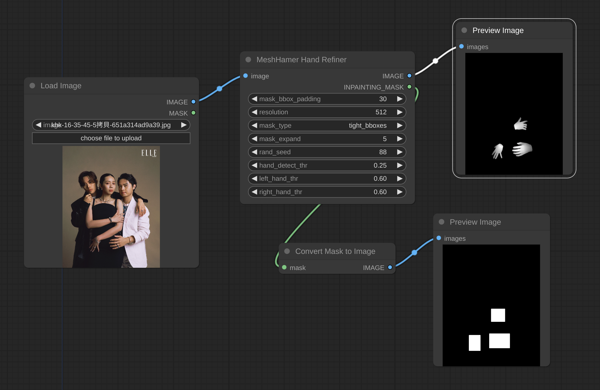

# ComfyUI-MeshHamer


## Installation
Before installation, you should install the [`CUDA_Toolkit`](https://developer.nvidia.com/cuda-toolkit-archive) first.

Enter to the `ComfyUI` root folder, run the following commands:

```shell
cd custom_nodes
git clone --recursive https://github.com/ader47/comfyui_meshhamer.git
cd comfyui_meshhamer
cd mesh_hamer
pip install -e .[all]
cd ./third-party/ViTPose
pip install -e .
````

## Configration

### Download models
I have uploaded the model files to the [Huggingface](https://huggingface.co/Edson125/mesh_hamer/tree/main).
The checkpoints and model config files should be placed in the following structure:
```shell
- comfyui_meshhamer
    - mesh_hamer
      - __DATA
        - data
          - mano
              MANO_RIGHT.pkl
          - mano_mean_params.npz
        - hamer_ckpts
          - checkpoints
              hamer.ckpt
          dataset_config.yaml
          model_config.yaml
        - vitpose_ckpts
          - vitpose+_huge
            wholebody.pth
      model_final_f05665.pkl
```

### **Notice**
**This pipline needs about 10GB VRAM**. If you have a GPU with less than 10GB VRAM, you can try to change `DEVICE` in the `config.py` file.
## TODO 
- Change the `dectectron2` or `ViTPose` to reduce the VRAM usage.
- Add external detector api.

# Acknowledgements
Parts of the code are borrowed from the following repositories:
- **[Hamer](https://github.com/geopavlakos/hamer/tree/main)**
- **[controlnet_aux](https://github.com/huggingface/controlnet_aux)**
- **[HandRefiner](https://github.com/wenquanlu/HandRefiner/tree/main)**